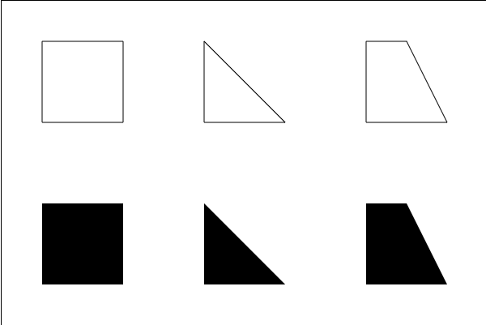
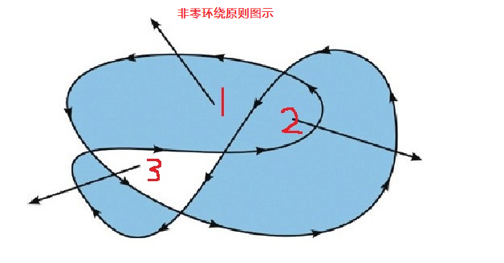

## Canvas 简介

  > Canvas是什么?

    Canvas(画布)是HTML5的一个新特性。传统的网页，总是使用GIF或者JPEG来显示图像，这种图形是需要事先画好，“静态”的图像；随着各种要求的发展，使用Flash或Java的“动态”图像也出现了。而Canvas，则是不使用Flash和Java，而是用Javascript在浏览器上绘图的一种手段。
    我们要用的Canvas其实是HTML文档中的一个元素,而我们所要学习的其实是HTML5赋予Canvas这个标签(元素)的一系列方法().

  > Canvas的应用领域

    1.游戏  
    2.数据可视化 http://echarts.baidu.com/
    3.banner广告 
    4.Canvas结合text, images, videos, 和 audio 产生高效而具有吸引力的用户体验。

  > Canvas效果展示

    1.知乎登录注册页动态离子背景效果
    2.表白时间
    3.坦克大战
    4.酷炫的演示文稿 http://www.axeslide.com/

  > 学习目标

    1.学会使用基本的canvas API,使用canvas可以完成简单的绘图
    2.实现数据可视化4
## Canvas 准备工作
  > 1. 使用canvas标签,即可在页面中开辟一块区域,可以设置其width和height属性以设置该区域的大小

  > 2. 默认canvas的宽高为300和150

  > 3. 不要使用css的方式设置宽高,应该使用html属性

  > 4. 如果浏览器不支持canvas标签,那么就会将其解释为div标签,因此常常在canvas中嵌入文本,以提示用户浏览器去升级

  > 5. canvas的兼容性非常强,只要支持该标签的,基本功能都一样,因此不用考虑兼容问题.

  > 6. canvas本身不能绘图,是使用javascript来完成绘图的,canvas对象提供了各种绘图用的API;

## 坐标系的方向与位置计算方法
  

  > canvas中的坐标系

    1.二维直角坐标系 以左上角为(0,0)点,X轴的正方向向右,Y轴的正方向向下
## 绘制的基本步骤
  > 1.布置画布:添加canvas元素

  ```html
    <!DOCTYPE html>
    <html lang="en">
      <head>
        <meta charset="UTF-8">
        <meta name="viewport" content="width=device-width, initial-scale=1.0">
        <meta http-equiv="X-UA-Compatible" content="ie=edge">
        <title>给页面添加一个Canvas</title>
      </head>
      <body>
        <canvas  style="border: 1px solid #aaaaaa; display: block; margin: 50px auto;" width="600" height="600">
          你的浏览器居然不支持Canvas？！赶快换一个吧！！
        </canvas>
      </body>
    </html>
  ```
  > 2.获取画布:获得canvas对象

  ```html
    <!DOCTYPE html>
    <html lang="en">
      <head>
        <meta charset="UTF-8">
        <meta name="viewport" content="width=device-width, initial-scale=1.0">
        <meta http-equiv="X-UA-Compatible" content="ie=edge">
        <title>给页面添加一个Canvas</title>
      </head>
      <body>
        <canvas  style="border: 1px solid #aaaaaa; display: block; margin: 50px auto;" width="800" height="600">
          你的浏览器居然不支持Canvas？！赶快换一个吧！！
        </canvas>
        <script>
          var canvas = document.querySelector('canvas');
        </script>
      </body>
    </html>
  ```
  > 3.获得画笔(2D环境):通过canvas对象的getContext("2d")方法，获得2D环境

  ```html
    <!DOCTYPE html>
    <html lang="en">
      <head>
        <meta charset="UTF-8">
        <meta name="viewport" content="width=device-width, initial-scale=1.0">
        <meta http-equiv="X-UA-Compatible" content="ie=edge">
        <title>给页面添加一个Canvas</title>
      </head>
      <body>
        <canvas  style="border: 1px solid #aaaaaa; display: block; margin: 50px auto;" width="800" height="600">
          你的浏览器居然不支持Canvas？！赶快换一个吧！！
        </canvas>
        <script>
          var canvas = document.querySelector('canvas');
          var content = canvas.getContext('2d');
        </script>
      </body>
    </html>
  ```  
  > 4.确定画笔下笔的点: moveTo(X,Y);

  > 5.确定画笔停笔的点: lineTo(X,Y);

  > 6.把下笔的点和停笔的点连起来: stroke(); 如果向填充图形: fill();
## 练习

  

## 非零环绕原则的作用与判断方法
  

  > 说明 
    非零环绕原则的作用: 主要用于图形的填充,判断一个区域是否填充:
    将计数器初始化为0，每当这个线段与路径上的直线或曲线相交时，就改变计数器的值，如果是与路径顺时针相交时，那么计数器就加1， 如果是与路径逆时针相交时，那么计数器就减1，如果计数器始终不为0，那么此区域就在路径范围里面，在调用fill()方法时，就会对其进行填充。如果最终值是0，那么此区域就不在路径范围内，不会对其进行填充。
## 开启新路径的作用是什么
## 绘制矩形的方法与擦除矩形区域的方法
## 绘制圆弧与扇形的步骤