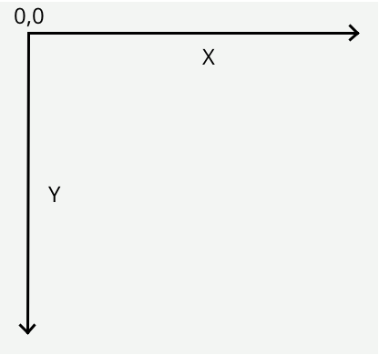

## Canvas 简介

  > Canvas是什么?

    Canvas(画布)是HTML5的一个新特性。传统的网页，总是使用GIF或者JPEG来显示图像，这种图形是需要事先画好，“静态”的图像；随着各种要求的发展，使用Flash或Java的“动态”图像也出现了。而Canvas，则是不使用Flash和Java，而是用Javascript在浏览器上绘图的一种手段。
    我们要用的Canvas其实是HTML文档中的一个元素,而我们所要学习的其实是HTML5赋予Canvas这个标签(元素)的一系列js方法.

  > Canvas的应用领域

    1.游戏  
    2.数据可视化 http://echarts.baidu.com/ --重点
    3.banner广告 youtube
    4.Canvas结合text, images, videos, 和 audio 产生高效而具有吸引力的用户体验。

  > Canvas效果展示

    1.知乎登录注册页动态离子背景效果
    2.表白时间
    3.坦克大战
    4.酷炫的演示文稿 http://www.axeslide.com/

  > 学习目标

    1.学会使用基本的canvas API,使用canvas可以完成简单的绘图
    2.实现数据可视化
## Canvas 准备工作
  > 1. 使用canvas标签,即可在页面中开辟一块区域,可以设置其width和height属性以设置该区域的大小

  > 2. 默认canvas的宽高为300和150

  > 3. 不要使用css的方式设置宽高,应该使用html属性

  > 4. 如果浏览器不支持canvas标签,那么就会将其解释为div标签,因此常常在canvas中嵌入文本,以提示用户浏览器去升级

  > 5. canvas的兼容性非常强,只要支持该标签的,基本功能都一样,因此不用考虑兼容问题.

  > 6. canvas本身不能绘图,是使用javascript来完成绘图的,canvas对象提供了各种绘图用的API;
## 坐标系的方向与位置计算方法
  

    1.二维直角坐标系 以左上角为(0,0)点,X轴的正方向向右,Y轴的正方向向下
## 从线段开始
   
   > 1. 在HTML中添加画布

   > 2. 通过js方法获取画布元素

   > 3. 通过canvas元素来获取画笔

   > 4. 移动画笔,使画笔移动至绘画的开始处

   > 5. 确定第一笔的停止点

   > 6. 规划好之后,选择画笔(包括画笔的粗细和颜色等等)

   > 7. 确定绘制(描边)

## 多线条组成图形
## 绘制矩形
## 线条的属性
## 填充颜色
## 填充纹理
## 绘制标准圆弧
## 使用切点绘制圆弧
## 二次贝塞尔曲线
## 三次贝塞尔曲线
## 平移变换
## 旋转变换
## 缩放变换
## 矩阵变换
## 文本显示与渲染
## 文本对齐与度量
## 全局阴影与图像合成
## 裁剪和绘制图像
## 非零环绕原则
## 最后的API