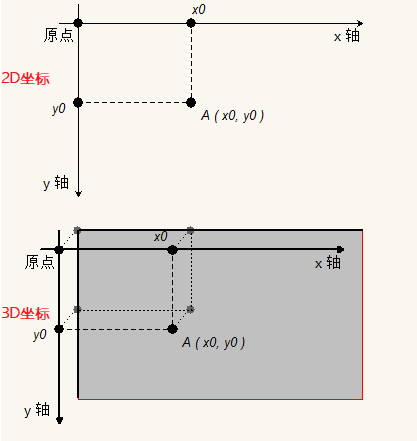

## Canvas 简介

  > Canvas是什么?

    Canvas(画布)是HTML5的一个新特性。传统的网页，总是使用GIF或者JPEG来显示图像，这种图形是需要事先画好，“静态”的图像；随着各种要求的发展，使用Flash或Java的“动态”图像也出现了。而Canvas，则是不使用Flash和Java，而是用Javascript在浏览器上绘图的一种手段。
    我们要用的Canvas其实是HTML文档中的一个元素,而我们所要学习的其实是HTML5赋予Canvas这个标签(元素)的一系列方法.

  > 为什么要学习Canvas

    1.Canvas 是Flash为基础的广告横幅和广告的极佳替代。吸引买家注意的所需的特性，它都拥有。
    2.Canvas 可以生成视觉吸引和互动的图表。
    3.Canvas结合text, images, videos, 和 audio 产生高效而具有吸引力的学习体验。

  > Canvas效果展示

    1.知乎登录注册页动态离子背景效果
    2.表白时间
    3.坦克大战
    4.数据图表  http://echarts.baidu.com/
    5.酷炫的演示文稿 http://www.axeslide.com/

  > 兼容性

  

  > 学习目标

    绘制数据可视化图形

## Canvas 准备工作

  > 1.布置画布:添加canvas元素

  ```html
    <!DOCTYPE html>
    <html lang="en">
      <head>
        <meta charset="UTF-8">
        <meta name="viewport" content="width=device-width, initial-scale=1.0">
        <meta http-equiv="X-UA-Compatible" content="ie=edge">
        <title>给页面添加一个Canvas</title>
      </head>
      <body>
        <canvas  style="border: 1px solid #aaaaaa; display: block; margin: 50px auto;" width="800" height="600">
          你的浏览器居然不支持Canvas？！赶快换一个吧！！
        </canvas>
      </body>
    </html>
  ```
  > 2.获取画布:获得canvas对象

  ```html
    <!DOCTYPE html>
    <html lang="en">
      <head>
        <meta charset="UTF-8">
        <meta name="viewport" content="width=device-width, initial-scale=1.0">
        <meta http-equiv="X-UA-Compatible" content="ie=edge">
        <title>给页面添加一个Canvas</title>
      </head>
      <body>
        <canvas  style="border: 1px solid #aaaaaa; display: block; margin: 50px auto;" width="800" height="600">
          你的浏览器居然不支持Canvas？！赶快换一个吧！！
        </canvas>
        <script>
          var canvas = document.querySelector('canvas');
        </script>
      </body>
    </html>
  ```
  > 3.获得画笔(2D环境):通过canvas对象的getContext("2d")方法，获得2D环境

  ```html
    <!DOCTYPE html>
    <html lang="en">
      <head>
        <meta charset="UTF-8">
        <meta name="viewport" content="width=device-width, initial-scale=1.0">
        <meta http-equiv="X-UA-Compatible" content="ie=edge">
        <title>给页面添加一个Canvas</title>
      </head>
      <body>
        <canvas  style="border: 1px solid #aaaaaa; display: block; margin: 50px auto;" width="800" height="600">
          你的浏览器居然不支持Canvas？！赶快换一个吧！！
        </canvas>
        <script>
          var canvas = document.querySelector('canvas');
          var content = canvas.getContext('2d');
        </script>
      </body>
    </html>
  ```  
## Canvas 坐标系

    
  > Canvas 2D坐标系

  
  
    canvas画布的左上角为笛卡尔坐标系(直角坐标系)的原点，且y轴的正方向向下，x轴的正方向向右

## 绘制图案的基本步骤

  > 1.移动画笔

    moveTo(X,Y) 移动画笔至这个点

  > 2.确定第一个停止点

    lineTo(X,Y) 笔画停点

  > 3.规划好之后，选择画笔

    lineWidth  控制画笔粗细
    strokeStyle 设置画笔颜色

  > 4.确定绘制

    context.stroke()
