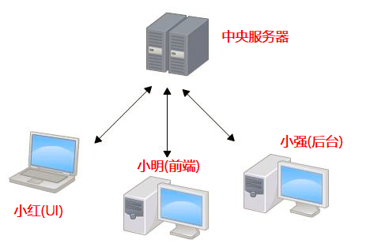
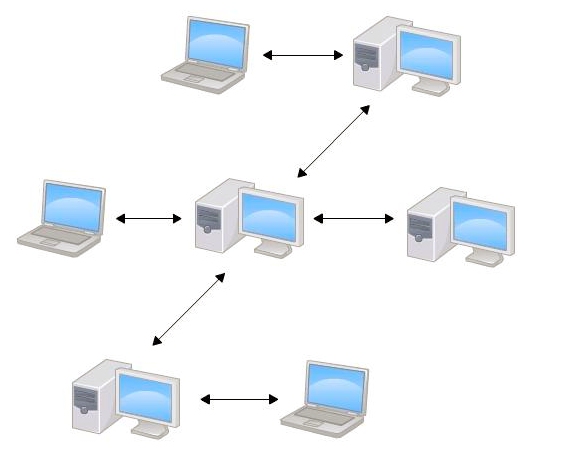

## Git是什么?

  Git是目前世界上最先进的分布式版本控制系统（没有之一）。Git有什么特点？简单来说就是：高端大气上档次！

## Git的诞生

  很多人都知道，Linus在1991年创建了开源的Linux，从此，Linux系统不断发展，已经成为最大的服务器系统软件了。Linus虽然创建了Linux，但Linux的壮大是靠全世界热心的志愿者参与的，这么多人在世界各地为Linux编写代码，那Linux的代码是如何管理的呢？事实是，在2002年以前，世界各地的志愿者把源代码文件通过diff的方式发给Linus，然后由Linus本人通过手工方式合并代码！你也许会想，为什么Linus不把Linux代码放到版本控制系统里呢？不是有CVS、SVN这些免费的版本控制系统吗？因为Linus坚定地反对CVS和SVN，这些集中式的版本控制系统不但速度慢，而且必须联网才能使用。有一些商用的版本控制系统，虽然比CVS、SVN好用，但那是付费的，和Linux的开源精神不符。不过，到了2002年，Linux系统已经发展了十年了，代码库之大让Linus很难继续通过手工方式管理了，社区的弟兄们也对这种方式表达了强烈不满，于是Linus选择了一个商业的版本控制系统BitKeeper，BitKeeper的东家BitMover公司出于人道主义精神，授权Linux社区免费使用这个版本控制系统。安定团结的大好局面在2005年就被打破了，原因是Linux社区牛人聚集，不免沾染了一些梁山好汉的江湖习气。开发Samba的Andrew试图破解BitKeeper的协议（这么干的其实也不只他一个），被BitMover公司发现了（监控工作做得不错！），于是BitMover公司怒了，要收回Linux社区的免费使用权。Linus可以向BitMover公司道个歉，保证以后严格管教弟兄们，嗯，这是不可能的。实际情况是这样的：Linus花了两周时间自己用C写了一个分布式版本控制系统，这就是Git！一个月之内，Linux系统的源码已经由Git管理了！牛是怎么定义的呢？大家可以体会一下。Git迅速成为最流行的分布式版本控制系统，尤其是2008年，GitHub网站上线了，它为开源项目免费提供Git存储，无数开源项目开始迁移至GitHub，包括jQuery，PHP，Ruby等等。历史就是这么偶然，如果不是当年BitMover公司威胁Linux社区，可能现在我们就没有免费而超级好用的Git了。

## 集中式与分布式

  > 集中式版本控制系统:

    代表: CVS  SVN
    特点: 版本库集中存放在中央服务器 必须联网才能工作  如果中央服务器的代码被恶意修改了,所有人的代码都可能会有问题

  

  > 分布式版本控制系统:

    代表: Git
    特点: 版本库在自己的电脑上 不需要联网也能工作  安全性高

  

## 安装Git

  > 在Linux上安装Git

    1. 如果碰到Ubuntu或Debian 请使用下面命令:
       
       $ git  //这条命令检查系统中是否有Git

       sudo apt-get install git  // 如果没有,则使用这条命令来进行安装Git

    2. 如果碰到的是 CentOS 请使用下面命令:

      $ git  // 这条命令检查系统中是否有Git

      sudo yum install git

  > 在Windows上安装Git

    1. 如果是32位系统 请使用安装包

       [32位系统的Git](./Other/Git-2.14.3-32-bit.exe)  

    2. 如果是64位系统 请使用安装包

       [64位系统的Git](./Other/Git-2.14.3-64-bit.exe)  
  > 在Mac OS 上安装Git

    自己上Git官网搜索

## 创建版本库(repository)

  > 1. 选择一个合适的地方,创建一个空目录

    # 打开命令行工具,输入命令 代表新建了一个名字为Git的文件夹

    mkdir  Git     

    # 进入Git文件夹中

    cd Git

    # 查看该文件夹的绝对位置(在windows中) **如果看到输入的pwd中有中文 请确保你的路径中没有中文**

    pwd

  > 2. 把刚才创建的文件夹目录变成Git可以管理的仓库

    # 初始化仓库
    git init   

    # 如果你的文件夹中没有任何内容将会得到如下输出结果 代表是初始化了一个空的Git仓库
    Initialized empty Git repository in G:/Git/.git/

## 版本回退
  > 1. 创建一个文件,并把该文件提交修改到Git版本库

    # 把要提交的文件添加到版本库
      git add 文件名

    # 把要提交的文件提交到版本库
      git commit -m  "本次提交的说明" 

  > 2. 查看提交的日志记录

    # 查看我们提交的历史记录
      git log  或 git log --pretty=oneline

  > 3. 版本回退

    # 把版本回退到前面的版本 当前版本 HEAD 上一个版本HEAD^  往上100个版本 HEAD~100
      git reset --hard HEAD^
  > 4. 查看自己的每一次命令的记录

    # 如果回退到某一个版本之后又后悔了,那么可以再回到某一次提交,这时可以查看自己的写过的命令
      git reflog

  > 5. 回到某一次的提交
    
    # 回到某一次提交就要找到某一次提交的id ,使用fit reflog可以查看自己的命令id

      git reset --hard id号
## 工作区和暂存区

## 管理修改

## 撤销修改

## 删除文件

## 添加远程库

## 从远程库克隆

## 创建与合并分支

## 解决冲突

## 分支管理策略

## 多人协作

## 忽略特殊文件

## GitHub

## 使用码云