# day01--基础知识&京东移动端
## 基础知识

#### 屏幕
讲移动端这门课程，咱们先从手机开始说起，接下来我们来给大家看一张图片

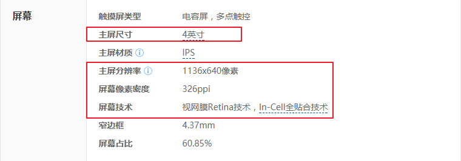

看这张图片的目的时为了让大家看到关于手机屏幕的一些参数，红框内的四个参数，大家一定都不陌生，我也不陌生。不过说真的，在很久以前我看到红框里的这四个参数，我并不知道这些参数时如何的来的。那接下里我们来学习一下。

* **屏幕尺寸(主屏尺寸)**

  现在大家看到的是iphone5的尺寸图 **主屏尺寸4英寸** 那么这个4英寸是怎么算出来的呢？首先我们解释一下英寸，它是一个英制长度单位，很多显示设备都用英寸来作为度量单位4英寸代表的是手机屏幕对角线的长度，1英寸=2.54厘米。那这个尺寸就是通过勾股定理计算的来的.

  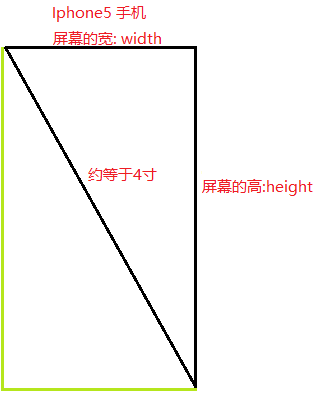

* **屏幕分辨率**

  在iphone5的参数图片中，我们同时也看到了一个参数 **屏幕分辨率** iphone5的分辨率是1136px*640px,那么这个分辨率又是怎么回事呢？
  在讲解分辨率之前，我们首先要明白一个概念，在手机上无论是呈现一条线,
  一个面,还是一张图像都是由最小的单位像素来表示的,你也可以简单理解为由一个个小方块组成的。比如大家看下面这幅图:

  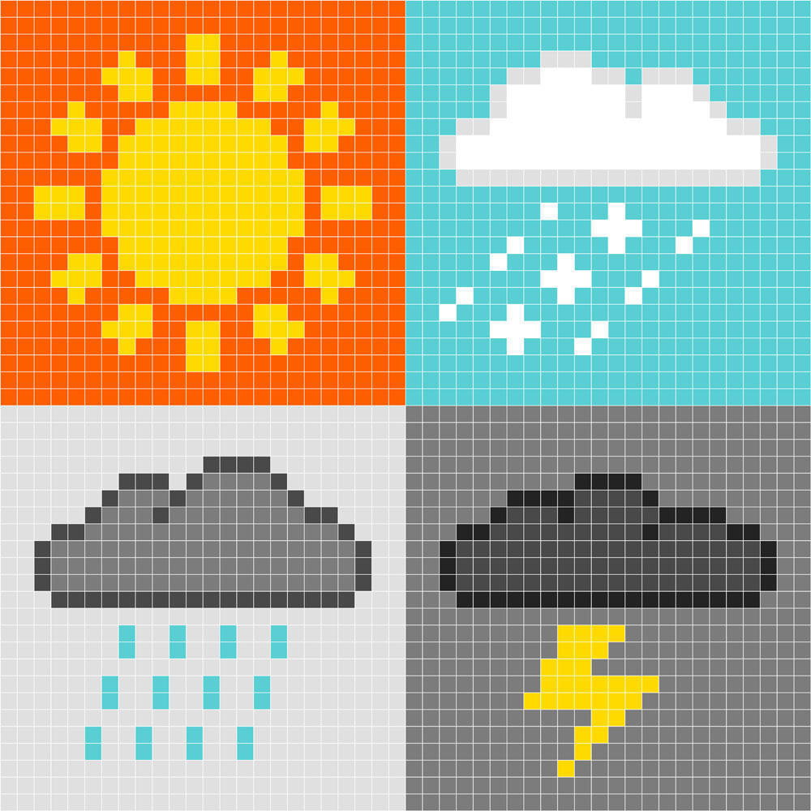

  所以,分辨率1136px*640px的意思就是iphone5的手机屏幕在竖直方向有1136个像素块，在水平方向有640个像素块。
* **长度单位**

  刚才我们介绍了主屏尺寸,它的单位是英寸(in),其实在我们的开发中有很多单位，但无论有多少单位,他们都会被分类到绝对长度单位或相对长度单位中。
  * 相对长度单位:相对长度单位就是会随着单位的使用的地方不同，其值会发生变化。
    * 比如:em px(只在表示设备分辨率的时候) %
  * 绝对长度单位:不会随着使用环境的变化而变化，值是绝对的。
    * 比如:in(英寸) cm(厘米) mm(毫米)
* **屏幕像素密度**

  在iphone5的参数图片中，我们同时也看到了一个参数 **屏幕像素密度**,它是什么意思呢？其实屏幕像素密度，即屏幕对角线每英寸所拥有的像素数，英文简称PPI(Pixels(像素) Per(每) Inch(英寸)),如何计算呢？这就必须用到上面我们讲的屏幕尺寸、屏幕分辨率,我们来看一幅图:
  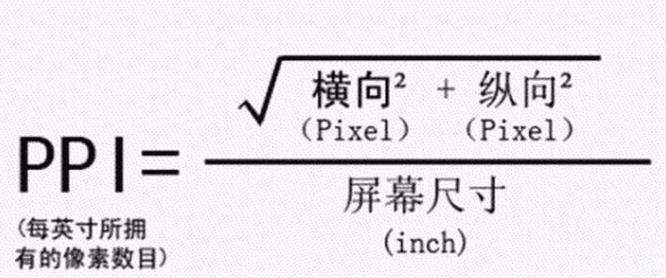

  知道了像素密度如何计算,下面来说为什么说像素是一个相对长度单位，我们来看一下iphone系列手机的PPI:
  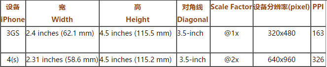

  通过上面的图我们可以知道iphone3GS和iphone4的屏幕都是3.5英寸,他们的分辨率iphone3GS在水平方向320px,iphone4在水平方向640px,那么在同样的屏幕尺寸下,能容纳不同的像素个数,说明像素是一个可变大小的单位。接下来我们再来说屏幕像素密度能帮我们做什么呢？下面再来看一张图

  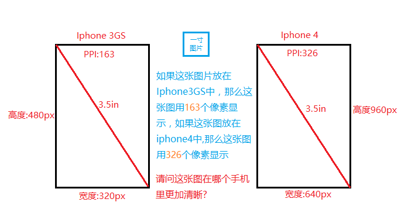
  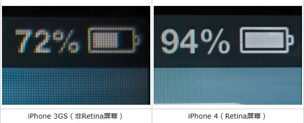

  通过上面的图示说明,**在相同屏幕尺寸下PPI值越大,那么所能显示的图像越清晰**
* **Retina屏幕**

  如果你明白了PPI(像素密度),那么Retina屏幕对你来说非常的简单,Retina是一个苹果注册的一个屏幕的名字，他们把PPI大于320的屏幕叫做Retina屏,也就是你们现在用的除了iphone3GS之外的其他苹果设备。
* **设备独立像素**

  设备像素也叫密度无关像素，之所以有这样一个概念是因为在我们的生活中出现了很多PPI不同的手机(ipone3GS的PPI:163,iphone4的PPI:326),像素不再是统一的单位,这样会造成一个问题:同样尺寸的图片在不同PPI的手机上显示的大小不一样(尤其是屏幕一样大小的ipone3GS和iphone4)。比如:

   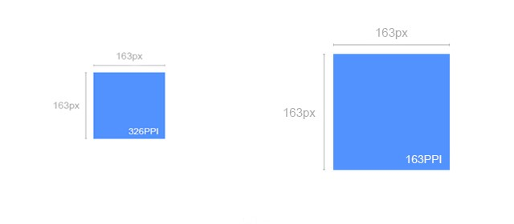

  大图是在iphone3GS(**PPI:163**)上显示的效果,iphone4(**PPI:326**)上显示的效果,但是用户却是不会关心这些细节的，他们只是希望在不同PPI的屏幕上看到看起来差不多的效果。这时我们就需要一个新的单位,我们希望这个单位能够保证图像内容在不同PPI设备上看上去差不多,这个单位就叫**设备独立像素**,因为这个单位和像素密度无关,因此也叫**密度无关像素**,这个单位在ios设备上叫:pt,在android设备上叫dp。
  举例说明就是**iPhone 3G（PPI为163）1dp = 1px，iPhone 4（PPI为326）1dp = 2px**。

   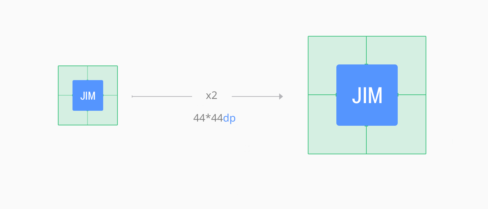

  通过上面例子我们不难发现dp同px是有一个对应（比例）关系的，这个对应（比例）关系是操作系统确定并处理，目的是确保不同PPI屏幕所能显示的图像大小是一致的.
  那如何获取这个比例呢？
  ```
  // 像素和设备独立像素的一个关系
      window.devicePixelRatio 
  ```
* **CSS像素**

  刚才我们说设备独立像素是一个单位,在android开发中用dp这个单位,在ios开发中用pt,那我们在移动web开发中用什么呢？就用css像素也就是px.既然pt和px有一个对应关系,那么设备像素和CSS像素有没有对应关系呢?当然有

   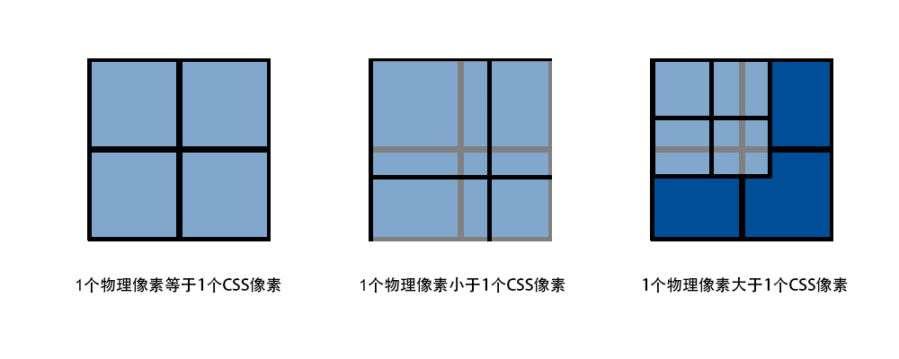
   
#### 视口(viewport)
* **定义**

  视口是用来约束网站中最顶级块元素(html)的,也就是它决定了html的大小。  

* **视口的作用**

  在PC设备上viewport的大小取决于浏览器窗口的大小，以CSS像素做为度量单位。通过以往CSS的知识，我们都能理解html的大小是会影响到我们的网页布局的,而viewport又决定了html的大小，所以viewport间接决定并影响了我们网页的的布局,只不过在PC端viewport的大小和浏览器窗口大小一致，因此我们不去管他,但移动端则不同。

  移动设备屏幕普遍都是比较小的，但是大部分的网站又都是为PC设备来设计的(在移动端处于萌芽时期),要想让移动设备也可以正常显示网页,移动设备不得不做一些处理,如果能让viewport足够大,那么html也会足够大,这样就能保证原本为PC设备设计的网页页能在移动设备上正常显示。移动设备厂商也的确是这样处理的。

  在移动设备上viewport不再受限于浏览器的窗口,而是允许开发人员自由设置viewport的大小,不过浏览器会设置一个默认大小的viewport,为了能够正常显示那些专为PC设计的网页,一般这个值的大小会大于屏幕的尺寸。

  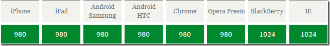

  从上图中我们可以得知不同的移动厂商分别设置了一个默认的viewport的值,这个值保证了大部分网页可以正常在移动设备下浏览。下面我们通过一个例子来验证上述结论:

  html代码
  ```
	  <div class="box">1</div>
	  <div class="box">2</div>
  ```
  css代码
  ```
		body {
			padding: 0;
			margin: 0;
			background-color: #F7F7F7;
		}

		.box {
			width: 490px;
			height: 200px;
			text-align: center;
			line-height: 200px;
			background-color: pink;
			float: left;
		}
  ```
  经过Iphone6手机在ios10系统下的测试,我们发现网页内容和图片被缩放了,我们也得到了其他开发者的反馈,在部分android手机中也会发生网页内容和图片缩放,而另外一部分android手机会出现滚动条。那产生缩放和滚动条的原因是什么呢？
* **详解视口**

  要明白为什么会产生缩放或滚动条,我们要进一步的学习viewport(视口)。首先,在默认情况下,移动设备上的viewport是大于可视区域的。然后我们人为的把viewport分成layout viewport和ideal viewport。
  
  **视窗布局视口**(layout viewport):网页布局区域的大小(以CSS像素为单位)
  
  **理想视口**(ideal viewport):大小就是设备屏幕区域(以设备独立像素dp、pt为单位)

  理解两个viewport后我们来解释为什么网页会被缩放或出现水平滚动条,其原因在于移动设备浏览器会默认设置一个layout viewport,并且这个值会大于ideal viewport,那么我们也知道ideal viewport就是屏幕区域,layout viewport是我们布局网页的区域,那么最终layout viewport 是要显示在ideal viewport里的,而layout viewport大于ideal viewport时,于是就出现了滚动条,那么为什么有的移动设备网页内容被缩放了呢？因为有些厂商认为将网页完整显示给用户才最合理,而不该出现滚动条,所以就将layout viewport进行了缩放,使其恰好完整显示在ideal viewport(屏幕)里,其缩放比例为ideal viewport/layout viewport。
* **视口设置**
  
  通过刚才分析,我们知道**移动端页面最理想的状态是,避免滚动条且不被默认缩放处理**,那么怎么做呢？就需要设置视口

  基本语法:
    ```
    <meta name="viewport" content="width=device-width,initial-scale=1.0">
    ```
   思想就是设置layout viewport=ideal viewport
   设置width=device-width 或initial-scale=1.0其中一个都可以,两个都要写的原因在于两者各有一个小缺陷，就是iphone、ipad以及IE 会横竖屏不分，通通以竖屏的ideal viewport宽度为准。所以，最完美的写法应该是，两者都写上去，这样就 initial-scale=1 解决了 iphone、ipad的毛病，width=device-width则解决了IE的毛病。
  
  其他设置:

    width 设置layout viewport 的宽度(带单位)，为一个正整数，或字符串"device-width"

    height 设置layout viewport的高度(带单位)，这个属性对我们并不重要，很少使用

    initial-scale 设置页面的初始缩放值(倍数)，为一个数字

    maximum-scale 允许用户的最大缩放值(倍数)，为一个数字

    minimum-scale 允许用户的最小缩放值(倍数)，为一个数字

    user-scalable 否允许用户进行缩放，值为"no"或"yes", no 代表不允许，yes代表允许
* **移动端布局方案**
  * 固定布局 (很早以前其实就用的固定宽度布局的方案,只不过现在已经被废弃了)
  * 百分比布局 (特别适合于电商网站的布局) 流式布局
  * rem布局方案 (用rem这个单位来做不同手机的适配) 现在做手机端页面最好的
* **移动端浏览器**
   手机自带浏览器:safari 安卓自带浏览器
   第三方浏览器:UC qq浏览器
   应用内置浏览器(webview):微信 qq 微博
      所谓的webview就是ios开发者或者安卓开发者为我们前端提供的一个简易的浏览器
      移动端开发:
          1.类原生app(稍微复杂一点)
          2.微信开发:就是把移动端页面扔到了微信的webview中(要做的兼容比较少) hubilder
#### 京东移动端(jdMobile)
* **项目背景**
  现在移动设备越来越多,以致于开发移动端页面的需求旺盛。为了应对诸如京东、淘宝这样的电商网站的开发，因此需要学习这些网站是如何制作的。同时京东移动端也是移动端百分比布局的代表(百分比布局不能适配所有手机)
* **项目技术点**

  1.百分比  1.百分比
  
  2.normalize与reset
    reset.css这样的css主要用于清除浏览器的默认样式
    normalize.css是一个著名的css库 作用:就是为了解决不同浏览器的兼容性 在以后工作中 用的比较多
              主要解决的是移动端开发的兼容性问题

* **项目结构**
  jdMobile(项目文件夹)

    * css(文件夹)----> 放置css文件

    * images(文件夹)----> 放置诸如网站logo,网站小图标这样的长时间不变的图片

    * upload(文件夹)----> 放置商家、用户上传的图片

    * js(文件夹) ----> 放置js文件(不过本项目不需要,放在这里的目的是让大家清楚)

    * favicon.ico ---->  网页图标

    * index.html ----> 项目首页
* **项目代码**

  基本结构

  ```
  <!DOCTYPE html>
  <html lang="en">
    <head>
      <meta charset="UTF-8">
      <!-- 设置视口 -->
      <meta name="viewport" content="width=device-width, initial-scale=1.0">
      <!--告诉浏览器如果是ie系列且有edge,就用edge这个浏览器的渲染方式去渲染-->
      <meta http-equiv="X-UA-Compatible" content="ie=edge">
      <title>专业网上购物平台品质保障！-京东商城</title>
    </head>
    <body>

    </body>
  </html>
  ```
  1.实现布局容器(注释序号的代表了写代码的顺序)

  ```
    <body>
      <div class="jdm">
        <!--1.顶部搜素-->
        <!--3.中间滚动内容-->
        <!--2.底部工具栏-->
      </div>
    </body>
  ```


1.配置ngrok

  用记事本编辑start.bat文件 打开之后会出现

  ngrok -config=ngrok.cfg -subdomain wanlum 80

  看到上面的wanlum 之后替换一个你自己起的名字

  检查本地apache服务器是否启动 如果启动 检查服务器的端口号是否为80 

  最后把自己练习的文件放到本地apache服务器中 就可以啦


  
