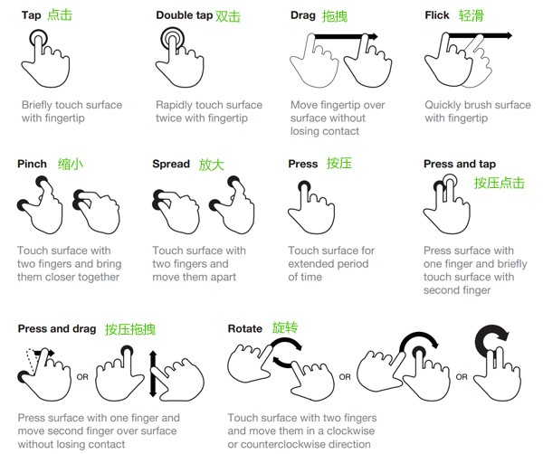

## 移动端事件(touchEvent)

  现在随着移动设备的出现,鼠标事件不能够满足多指触控的事件需求,再加上click点击事件在移动端存在延迟,因此在移动端出现了移动端事件也叫TouchEvent.TouchEvent 是一类描述手指在触摸平面（触摸屏、触摸板等）的状态变化的事件。这类事件用于描述一个或多个触点，使开发者可以检测触点的移动，触点的增加和减少，等等。

#### touchEvent类型

  >  touchstart 当用户在触摸平面上放置了一个触点时触发。

  >  touchend 当一个触点被用户从触摸平面上移除（当用户将一个手指离开触摸平面）时触发。

  >  touchmove 当用户在触摸平面上移动触点时触发。

#### touchEvent对象

  >  touches  

    代表的是屏幕上总共有几个触点

  >  targetTouches 

    代表的是绑定事件的元素上有几个触点

  >  changedTouches 
                    
    相对于上一次状态（进入目标元素、离开目标元素、在目标元素上发生了移动）发生了改变的触摸点的集合
    (在touchend事件里面 只能通过changedTouches获取离开目标元素的手指)
    最后有可能有一个离开了屏幕  只会在changedTouches中存在一个触点的数据
    最后有可能有两个同时离开了屏幕 就会在changedTouches中存在两个触点的数据

#### touch对象

  >  clientX/Y (推荐用的)
      
    相对于浏览器可视区域(屏幕)的坐标。想要获取正确的结果必须写全viewport的设置

  >  pageX/Y 
  
    相对于页面的坐标(页面有多大 坐标的最大值就有多大 但是想要看到这个结果 必须写全viewport的设置)
    <meta name="viewport" content="width=device-width,initial-scale=1.0,maximum-scale=1.0,minimum-scale=1.0,user-scalable=no">

  >  screenX/Y(不用 因为有兼容性) 
    相对于屏幕的坐标（谷歌下是相对于屏幕-火狐下是和clientX/Y是一样的）
  
#### 移动端手势介绍
  
#### 手势封装

  >  tap手势:单击  判断起始点的坐标和终止点的坐标是否一致

  >  drag手势:拖拽  就是把一个物体从一个地方拖拽到另一个地方  公式:原始位置(left top)+手指移动的距离(x y的差值)

  >  swipe手势:swipe的功能是为了判断手势的方向

  >  触屏轮播图案例

  > Click延迟300ms

    Click事件在移动手机开发中有300ms的延迟，因为在手机早期，浏览器系统有放大和缩放功能，用户在屏幕上点击两次之后，系统会触发放大或者缩放功能，因此系统做了一个处理，当触摸一次后，在300ms这段时间内有没有触摸第二次，如果触摸了第二次的话，说明是触发放大或缩放功能，否则的话是click事件。因此当click时候，所有用户必须等待于300ms后才会触发click事件。所以当在移动端使用click事件的时候，会感觉到有300ms的迟钝。
    其实Click延时不是精确的300ms 他是一个习惯性的名称 而是因为用户通过正常的点击 click事件大概在300ms的时候触发(一般情况下 300ms延迟说的是 大概在200-300ms左右)

  > 解决

      1.veiwport设置
      2.fastClick插件

#### iScroll

  > 下载地址:https://github.com/cubiq/iscroll

  > 中文文档:https://iiunknown.gitbooks.io/iscroll-5-api-cn/

  > iScroll是什么?

    iScroll是一个高性能，资源占用少，无依赖，多平台的javascript滚动插件。

  > iScroll使用方法
  
#### zepto(重点)
  > zepto.js

  > 下载地址:https://github.com/madrobby/zepto

  > 中文文档:http://www.css88.com/doc/zeptojs_api/
  
  > zepto是什么?
    
    Zepto是一个轻量级的针对现代高级浏览器的JavaScript库， 它与jquery有着类似的api。 如果你会用jquery，那么你也会用zepto。
    1.zepto比jquery要小
    2.jquery已经有了大量的用户  选择了和jquery的方法和调用一样的一个库 就是zepto
    3.zepto完整的压缩完 40k 适应于移动端轻量级的特点
    4.zepto是分模块的默认的只有5个核心模块 其他的都是按需使用

  > zepto的模块介绍 

     核心模块 5个 
     总共有17个模块

  > zetpo使用举例

  > zepto定制
    默认的zepto只有默认的5个模块
    如果想用其他的需要的模块 那么需要定制
    步骤:
        1.安装node
        2.去github下载zepto-master.zip
        3.把zepto-master.zip解压 进入有很多文件的文件夹中
        4.安装键盘shift 打开命令行窗口
        5.输入命令:npm install 
        6.定制
            6.1 找到package.json同级文件中的make文件的41行
            6.2 如果你需要什么模块 就把名称添加进入 
            6.3 执行npm run-scripts dist
            6.4 如果有问题 查看zepto中的readme.md
#### swipe

  > swipe.js

   下载地址:https://github.com/thebird/Swipe

   中文文档:无中文文档 英文文档为github地址

  > swipe是什么?
    
    swipe是最精准的触摸轮播图插件

  > swipe使用方法?
  
    如果出现鼠标手指触摸之后不能轮播的情况 请修改代码
    function stop() {
      //delay = 0;
      delay = options.auto > 0 ? options.auto : 0;
      clearTimeout(interval);
    }

#### fastclick

  > 下载地址:https://github.com/ftlabs/fastclick

  > 中文文档:无中文文档 英文文档为github地址

  > fastclick是什么?

    移动端事件会比鼠标事件快大约300ms 还有一个bug 只不过这个bug不去修改
    

  > fastclick使用方法?

    FastClick.attach(document.body);