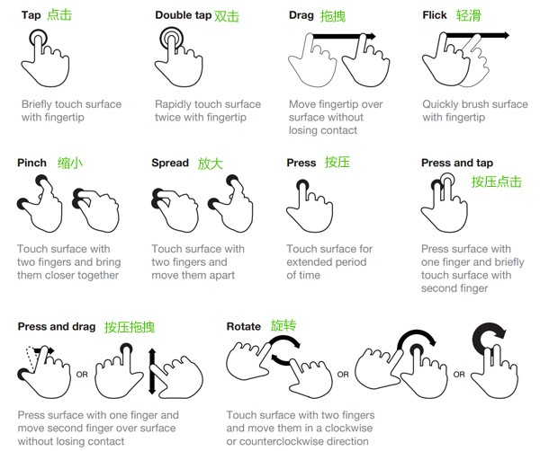

## 移动端事件(touchEvent)
  TouchEvent 是一类描述手指在触摸平面（触摸屏、触摸板等）的状态变化的事件。这类事件用于描述一个或多个触点，使开发者可以检测触点的移动，触点的增加和减少，等等。
  #### touchEvent类型

  >  touchstart 当用户在触摸平面上放置了一个触点时触发。

  >  touchend 当一个触点被用户从触摸平面上移除（当用户将一个手指离开触摸平面）时触发。

  >  touchmove 当用户在触摸平面上移动触点时触发。

  #### touchEvent对象

  >  touches  位于屏幕上的所有手指的列表

  >  targetTouches 位于该元素上的所有手指的列表

  >  changedTouches touchstart时包含刚与触摸屏接触的触点，touchend时包含离开触摸屏的触点

  #### touch对象

  >  clientX/Y 手指相对 layout viewport的水平/垂直像素距离(在屏幕宽度内的距离)

  >  pageX/Y 手指相对于layout viewport的水平/垂直像素距离（包含滚动）

  >  screenX/Y 手指相对于layout viewport的水平/垂直像素距离（包含滚动）
  
  #### 移动端手势介绍
  
  #### 手势封装

  >  tap手势:单击  判断起始点的坐标和终止点的坐标是否一致

  >  drag手势:拖拽  就是把一个物体从一个地方拖拽到另一个地方  公式:原始位置(left top)+手指移动的距离(x y的差值)

  >  swipe手势:swipe的功能是为了判断手势的方向

  >  触屏轮播图案例

  > Click延迟300ms

    Click事件在移动手机开发中有300ms的延迟，因为在手机早期，浏览器系统有放大和缩放功能，用户在屏幕上点击两次之后，系统会触发放大或者缩放功能，因此系统做了一个处理，当触摸一次后，在300ms这段时间内有没有触摸第二次，如果触摸了第二次的话，说明是触发放大或缩放功能，否则的话是click事件。因此当click时候，所有用户必须等待于300ms后才会触发click事件。所以当在移动端使用click事件的时候，会感觉到有300ms的迟钝。
    其实Click延时不是精确的300ms 他是一个习惯性的名称 而是因为用户通过正常的点击 click事件大概在300ms的时候触发  时间可以很短 只要手指快速点击屏幕
  > 一般在移动端 click事件为什么会延迟300ms (要能解释清除)
  > 300ms只是一个名字并不是绝对的300ms

  #### 移动端类库

  > zepto.js

  > iScroll.js

  > swipe.j

  > fastclick.js
